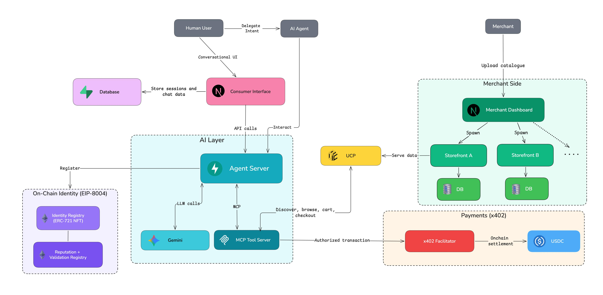

# Aaroh — Agentic Commerce

A crypto-native agentic commerce stack: AI agents discover merchants, shop autonomously, and pay with USDC — with optional human oversight in chat.

Built on the [Universal Commerce Protocol (UCP)](https://developers.google.com/merchant/ucp/guides), [x402](https://x402.org) crypto payments (USDC / EIP-3009), and [EIP-8004](https://github.com/EIPs-CodeLab/ERC-8004) trustless agent identity.

---

## Demo

Click below to watch the demo:

<p align="center">
  <a href="https://www.youtube.com/watch?v=KfYrAlz9Nl4">
    
  </a>
</p>

---

## Architecture



---

## The journey

### Step 1: Merchant goes live

1. Open the **merchant app** → **Onboard**: upload a catalogue (CSV or XLSX), enter an EVM wallet to receive USDC, optional tags/description.
2. After onboarding, open **Dashboard** → **Start** the UCP server for that merchant (assigns a local port, tails logs, links to `/.well-known/ucp`).
3. From the dashboard you can inspect **products** and **orders** while the server runs.

With just three steps, the merchant is live, fully compliant with UCP, and ready to be discovered by agents.

### Step 2: Consumer creates an agent

1. Now that we have merchants, visit the **consumer app**, sign in (Privy + optional guest flows).
2. **Agents → New agent** — the app calls `agent.py` `POST /agents` to mint an EVM keypair **server-side** (encrypted at rest); you only see the public address.
3. Fund the agent with **USDC on Base Sepolia** to allow the agent to shop autonomously. Add ETH to register an EIP-8004 identity.
4. Give the agent an identity by clicking on the agent detail page and registering the EIP-8004 identity. This automatically takes care of creating an agent.json file and publishing it to IPFS. All of this is verifiable on-chain.

**Examples**: 
- [Agent Wallet](https://sepolia.basescan.org/address/0x7ABDC88c77cc6dC87C94ea2cDE373e9eaf4f8508)
- [Agent ERC-8004 NFT](https://sepolia.basescan.org/nft/0x8004A818BFB912233c491871b3d84c89A494BD9e/3142)
- [Agent Manifest](https://gateway.pinata.cloud/ipfs/QmP5TFRTaVArV7eiqsP8M5AKm8jYUM9FfPhwyrDxVAVXd5)
- [Reputation / Agent feedback](https://sepolia.basescan.org/tx/0x795f298144e3194f2b510fd48690d433fffabf8f6992e8b9ae788a637773fef0)

### Step 3a: Agent shops autonomously
1. **Dispatch a task** from the agent detail page — the consumer app creates an `AgentSession` and calls `POST /shop` on `agent.py` with your natural-language goal (and optional merchant URLs / discovery seeds).
2. The agent can discover → plan → execute → verify → pay, with guardrails (budget, retries, max iterations).
3. **Watch live** via SSE: task events stream to the UI; when the run finishes, events are persisted on the session.
4. **Download `agent_log.json`** from the task UI — structured export from `GET /tasks/{task_id}/log` (events, budget, final output).

### Step 3b: Human shopping experience

1. Similar to the agent, humans can also shop with the same MCP tools exposed to the agent, visible in the **chat** tab of the consumer app.
2. Instead of autonomous payments, there is a payment button presented to the user to sign the payment and complete the checkout.

#### Agent shopping toolkit (MCP)

The **same shopping session** backs MCP and the autonomous agent. In MCP, the human (or desktop client) may complete payment with a wallet-signed `X-PAYMENT` string; the **autonomous agent** signs **EIP-3009** itself via `submit_payment` and can call `verify_transaction` and `check_agent_reputation` ([`shopping/tools.py`](shopping/tools.py)).

| Tool | Description |
|------|-------------|
| `list_merchants` | Discover merchants from `MERCHANT_URL` / `MERCHANT_URLS` (probes `/.well-known/ucp`); optional category filter |
| `find_merchant` | Match by name or category; auto-connects if exactly one hit |
| `discover_merchant` | Connect to a merchant by base URL |
| `browse_categories` | List categories from the connected merchant |
| `search_products` | Search by keyword and/or category |
| `get_product` | Full product details by ID |
| `add_to_cart` | Add line items |
| `view_cart` | Current cart and totals |
| `update_cart` | Change quantity (0 removes) |
| `remove_from_cart` | Remove a line |
| `checkout` | Create checkout session; returns x402 payment requirements |
| `get_checkout_status` | Poll checkout session status on the merchant |
| `complete_checkout` | Submit base64 `X-PAYMENT` after the user signs in their wallet |

**Autonomous-only tools** (same stack, not exposed on MCP): `submit_payment` (agent wallet signs USDC authorization), `verify_transaction`, `check_agent_reputation`.

### Step 4: Verify and rate

1. **Transactions** in the consumer app lists persisted orders (`ConsumerOrder`).
2. After a task, use **thumbs up/down** to submit **on-chain reputation** via `ReputationRegistry.giveFeedback` (your user wallet pays gas).
3. Agents can **read reputation** with the `check_agent_reputation` tool when configured.

---


### Project structure

| Path | Description |
|------|-------------|
| [`consumer/`](consumer/) | Next.js consumer app (port 3000) — chat, agents, commerce UI, MCP wiring, SSE proxies |
| [`merchant/`](merchant/) | Next.js merchant app (port 3001) — onboard, dashboard, UCP process control |
| [`landing/`](landing/) | Next.js marketing site (port 4000) |
| [`agent.py`](agent.py) | FastAPI autonomous agent — `/shop`, `/tasks`, `/agents`, EIP-8004 helpers |
| [`mcp_client.py`](mcp_client.py) | MCP server (stdio) for any MCP client |
| [`shopping/`](shopping/) | Shared session, tools, agent loop, identity, IPFS helpers |
| [`onboard_merchant.py`](onboard_merchant.py) | CLI: catalogue → UCP merchant package |
| [`rest/python/server/`](rest/python/server/) | UCP merchant server (FastAPI + SQLite + x402) |
| [`demo_data/`](demo_data/) | Sample catalogues |
| [`docker-compose.yml`](docker-compose.yml) | Optional local orchestration |

### Quick start

**Prerequisites:** Python ≥ 3.10 + [uv](https://docs.astral.sh/uv/), Node.js ≥ 18 + pnpm, PostgreSQL (or Supabase), USDC on **Base Sepolia** for paying agents.

**Environment:** Copy `.env.example` at the repo root and in `consumer/` and `merchant/` (`cp .env.example .env.local`). Fill keys for Postgres, Auth.js, Privy, LLM APIs, and agent URLs — see comments in each file.

**Consumer**

```bash
cd consumer && pnpm install && pnpm db:migrate && pnpm dev   # http://localhost:3000
```

**Merchant**

```bash
cd merchant && pnpm install && pnpm dev   # http://localhost:3001
```

> Migrations live only in `consumer/` — both apps share one database. Run `pnpm db:migrate` from `consumer` only.

**Agent** (repo root)

```bash
cp .env.example .env
# Required for consumer-created agents: AGENT_KEY_ENCRYPTION_SECRET
# Recommended: AGENT_API_SECRET (match consumer AGENT_API_SECRET)
uv run agent.py   # http://localhost:8004
```

**UCP server** — after onboarding, start from the merchant dashboard, or manually `uv run server.py` under `rest/python/server/` with paths from `deploy/<slug>/`.

**Landing (optional):** `cd landing && pnpm install && pnpm dev -- -p 4000` → http://localhost:4000

**Chat models:** Consumer chat supports Gemini and OpenAI (see `consumer/.env.example`). The autonomous agent defaults to **Gemini 2.5 Flash** (`GEMINI_MODEL`).

---

## References and verifiability

| Resource | Link |
|----------|------|
| Universal Commerce Protocol | https://developers.google.com/merchant/ucp/guides |
| x402 | https://x402.org |
| EIP-8004 / ERC-8004 | https://github.com/EIPs-CodeLab/ERC-8004 |
| EIP-3009 (USDC transfer with authorization) | https://eips.ethereum.org/EIPS/eip-3009 |
| Demo video | https://www.youtube.com/watch?v=KfYrAlz9Nl4 |
| Agent Wallet | https://sepolia.basescan.org/address/0x7ABDC88c77cc6dC87C94ea2cDE373e9eaf4f8508 |
| Agent ERC-8004 NFT | https://sepolia.basescan.org/nft/0x8004A818BFB912233c491871b3d84c89A494BD9e/3142 |
| Published Agent Manifest | https://gateway.pinata.cloud/ipfs/QmP5TFRTaVArV7eiqsP8M5AKm8jYUM9FfPhwyrDxVAVXd5 |
| Reputation / Agent feedback | https://sepolia.basescan.org/tx/0x795f298144e3194f2b510fd48690d433fffabf8f6992e8b9ae788a637773fef0 |
| IdentityRegistry (Sepolia explorer) | https://sepolia.basescan.org/address/0x8004A818BFB912233c491871b3d84c89A494BD9e_ |
| ReputationRegistry (Sepolia explorer) | https://sepolia.basescan.org/address/0x8004B663056A597Dffe9eCcC1965A193B7388713 |

---

## License

Apache 2.0 — see [LICENSE](LICENSE).
